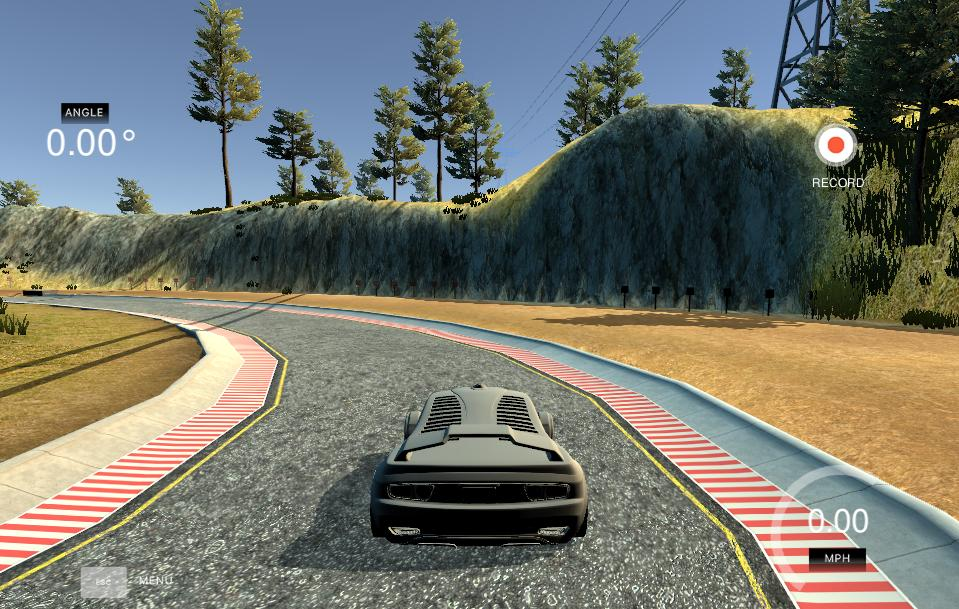

# Behaviorial Cloning 

[YouTube Demo Link](https://www.youtube.com/watch?v=zcau9W1jO9g)

Overview
---
The object of this project is to apply deep learning techniques to teach a car to drive autonomously in a simulated driving application. Here, driving a vehicle is defined as a supervised regression problem between the car steering angles and the road images. The [Udacity simulator](https://github.com/udacity/self-driving-car-sim)  provides two tracks, which can be used for data collection "training mode," or testing the model "autonomous mode." In training mode, images from a car dashboard camera as well as control data (steering angle, throttle, brake, speed) are recorded as the user drives the car manually. These data are used to train a deep convolutional network implemented using the **Keras** framework. The network architecture is similar to the [NVIDIA model](https://devblogs.nvidia.com/deep-learning-self-driving-cars/), which has been provided excellent results in these types of problems. 
  

  

All the code for this project is contained in this [Jupyter notebook](./BehavioralCloning_Nvidia.ipynb). 

Once the model is trained, its performance can be evaluated using the "autonomous mode." To test the model, run ``python drive.py ./model/ model_name.h5``  where *model_name.h5* is the name of the model to evaluate. 
  
#### Model Parameters

* learning rate = 0.001
* EPOCHS = 30
* BATCH_SIZE = 60
* Type of optimizer: AdamOptimizer
  

**Note:** The  [Udacity simulator](https://github.com/udacity/self-driving-car-sim) and training data collected from the simulator are not  included in this repo. Find more info and the Udacity seed project  [Here.](https://github.com/udacity/CarND-Behavioral-Cloning-P3)

