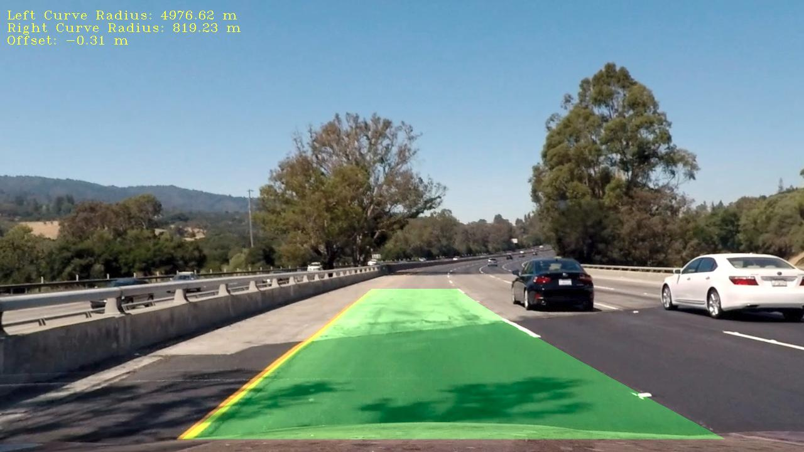

## Advanced Lane Detection

 
<a href="https://youtu.be/VM2cVMHziPY" target="blank">YouTube Demo Link</a>

Overview
---

In this project, computer vision techniques are used to  augment video output with a detected road lane, road radius curvature and road centre offset. The implemented pipeline includes the following steps:

**A.** Computing the camera calibration matrix and distortion coefficients from a set of chessboard images.
**B.** Applying a distortion correction to raw images.
**C.** Using color transforms, and image processing techniques to create a thresholded binary image.
**D.** Applying a perspective transform to rectify binary image ("birds-eye view").
**E.** Detecting lane pixels and fit to find the lane boundary.
**F.** Determining the curvature of the lane and vehicle position in respect to the center.
**G.** Merging the detected lane boundaries into the original image.
**H.** Producing a visual display of the lane boundaries and numerical estimation of lane curvature and vehicle position.

[//]: # (Image References)

[image1]: ./imgs/cheseCorected01.png   "Undistorted ChessBoard"
[image2]: ./imgs/cheseCorected02.png   "Undistorted ChessBoard2"
[image3]: ./imgs/test_imgCorrected.png   "Undistorted Test Image"
[image4]: ./imgs/test_imgCorrected2.png   "Undistorted Test Image"
[image5]: ./imgs/thr01.png   "Thresholding Example 01"
[image6]: ./imgs/thr02.png   "Thresholding Example 02"
[image7]: ./imgs/thr03.png   "Thresholding Example 03"
[image8]: ./imgs/trans.png   "Bird Eye View"
[image9]: ./imgs/eye_th.png   "Bird Eye View Threshold"
[image10]: ./imgs/slidingWindow.png   "Sliding window result"
[image11]: ./imgs/searchMargin.png   "searchMargin result"
[image12]: ./imgs/logo.jpg  "result01"
[image13]: ./imgs/logo.jpg  "result01"

All the code for this project is contained in a [Jupyter notebook](./AdvanceLaneDetection.ipynb). 

  
### Camera calibration chessboard

![alt text][image1]
![alt text][image2]

####Distortion-corrected samples

![alt text][image3]
![alt text][image4]

#### Color Filtering

![alt text][image5]
![alt text][image6]

#### Perspective transform
 ![alt text][image8]

![alt text][image9]

#### Identified lane-line pixels 

![alt text][image10]

#### Fit a polynomial
 
![alt text][image11]

#### Final results
![alt text][image12]
![alt text][image13]

---

 [YouTube Demo Link](https://youtu.be/VM2cVMHziPY)
---

