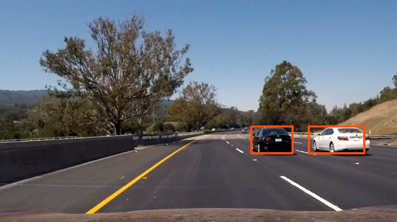

# Vehicle Detection and Tracking Pipeline

[YouTube Demo Link](https://youtu.be/DwudAsXfoIM)

Overview
---
This project represents a software pipeline to detect vehicles in a video.

**Pipeline Steps:**

* Perform a Histogram of Oriented Gradients (HOG) feature extraction on a labeled training set of images.
* Train a Linear SVM classifier.
* Implement a sliding-window technique and use the trained classifier to search for vehicles in images.
* Create a heat map of recurring detections frame by frame to reject outliers and follow detected vehicles.]
* Estimate a bounding box for the detected vehicles.]

All the code for this project is contained in this [Jupyter notebook](./Vehicle Detection.ipynb). 
