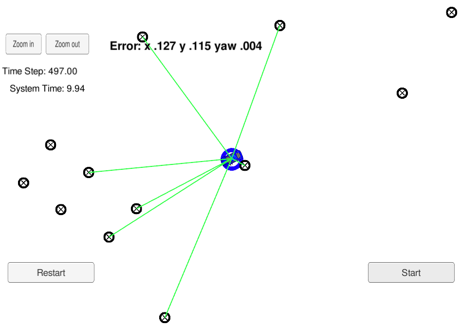

# Kidnapped Vehicle


 
## Overview
This project represents an object-oriented implementation of a 2D (two-dimentional) particle filter using C++. Here, a particle filteris utilized  to estimation of a vehicle’s location and heading orientation. A [simulator provided by Udacity](https://github.com/udacity/self-driving-car-sim/releases) provides the script for the noisy position data, vehicle controls, and noisy observations. The simulator can also display the best particle's sensed positions, along with the corresponding map ID associations.  The  [uWebSocketIO](https://github.com/uWebSockets/uWebSockets)  package facilitates the connection between the simulator and code by setting up a web socket server connection from the C++ program to the simulator, which acts as the host. 


## Prerequisites & Dependencies

This project involves the CarND Simulator ( Term 2) which can be downloaded [here.](https://github.com/udacity/self-driving-car-sim/releases)

This repository includes two files that can be used to set up and install [uWebSocketIO](https://github.com/uWebSockets/uWebSockets) for either Linux or Mac systems.  To install the uWebSocketIO libraries, use `install-linux.sh ` on Linux or `./install-mac.sh ` on Mac system.

The project Also has the following dependencies:

  * cmake >= 3.5
&nbsp;&nbsp;&nbsp;&nbsp;All OSes: [click here for installation instructions](https://cmake.org/install/)<br/>

  * make >= 4.1 (Linux, Mac)
  &nbsp;&nbsp;&nbsp;&nbsp; Linux: make is installed by default on most Linux distros
  &nbsp;&nbsp;&nbsp;&nbsp;Mac: [install Xcode command line tools to get make](https://developer.apple.com/xcode/features/)<br/>
  
  * gcc/g++ >= 5.4
   &nbsp;&nbsp;&nbsp;&nbsp;Linux: gcc / g++ is installed by default on most Linux distros
  &nbsp;&nbsp;&nbsp;&nbsp;Mac: same deal as make - [install Xcode command line tools](https://developer.apple.com/xcode/features/)

## Basic Build Instructions

Clone this repo, and cd to it on a Terminal. Install *uWebSocketIO* as described above. Once the installation of uWebSocketIO is complete, the main program can be built and run by doing the following from the project top directory.
```sh
# To build
mkdir build && cd build
cmake ..
make

# To run
./particle_filter
```


