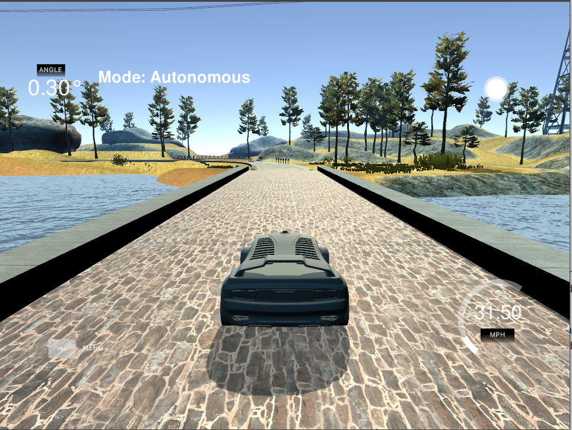

# PID Controller


 
## Overview
This project represents an object-oriented implementation of a PID controller in C++ to maneuver the vehicle around a simulated track. A [simulator provided by Udacity](https://github.com/udacity/self-driving-car-sim/releases) provides the cross track error (CTE) and the velocity (mph) in order to compute the appropriate steering angle. The implemented PID controller generates steering commands to control the car around the track. The  [uWebSocketIO](https://github.com/uWebSockets/uWebSockets)  package facilitates the connection between the simulator and code by setting up a web socket server connection from the C++ program to the simulator, which acts as the host. 


## Prerequisites & Dependencies

This project involves the CarND Simulator ( Term 2) which can be downloaded [here.](https://github.com/udacity/self-driving-car-sim/releases) This repository includes two files that can be used to set up and install [uWebSocketIO](https://github.com/uWebSockets/uWebSockets) for either Linux or Mac systems.  To install the uWebSocketIO libraries, use `install-linux.sh ` on Linux or `./install-mac.sh ` on Mac system.

The project Also has the following dependencies:

  * cmake >= 3.5
&nbsp;&nbsp;&nbsp;&nbsp;All OSes: [click here for installation instructions](https://cmake.org/install/)<br/>

  * make >= 4.1 (Linux, Mac)
  &nbsp;&nbsp;&nbsp;&nbsp; Linux: make is installed by default on most Linux distros
  &nbsp;&nbsp;&nbsp;&nbsp;Mac: [install Xcode command line tools to get make](https://developer.apple.com/xcode/features/)<br/>
  
  * gcc/g++ >= 5.4
   &nbsp;&nbsp;&nbsp;&nbsp;Linux: gcc / g++ is installed by default on most Linux distros
  &nbsp;&nbsp;&nbsp;&nbsp;Mac: same deal as make - [install Xcode command line tools](https://developer.apple.com/xcode/features/)

## Basic Build Instructions

Clone this repo, and cd to it on a Terminal. Install *uWebSocketIO* as described above. Once the installation of uWebSocketIO is complete, the main program can be built and run by doing the following from the project top directory.
```sh
# To build
mkdir build && cd build
cmake ..
make

# To run
./pid
```
## PID Controller
 
- **Proportional (P)**  represents the proportional tuning to the current error value. In this project, p is the distance between the car and the reference point (center of the road). If the error is large, the P control output is also large and if the error is small, the control output is also small.

 - **Integral (I)** represents the cumulative error. This parameter integrates the error term over a period of time aiming to make it zero. This controller limits the speed of response and affects the stability of the system.
 
  - **Differential (D)**  Stabilizes the system as the error is minimized. A small Kd value will cause the car to oscillate and a Kd value that is too large will cause the system to be sensitive to small error changes.


## Tuning Parameters

Kp: 0.1, Ki=0, Kd=0: The car ended in the lake!  
Kp: 0.1, Ki=0.001, Kd=0: no improvment!  
Kp: 0.1, Ki=0.001, Kd=1.0: stable results. however, the car left the drivable portion of the track surface several times.   
Kp: 0.2, Ki=0.001, Kd=1.0: More oscillation but the car stays inside the drivable portion of the road.   
Kp: 0.2, Ki=0.001, Kd=2.0: Less oscillation and the car stays inside the drivable portion of the road.   
Kp: 0.2, Ki=0.001, Kd=5.0: Car stays inside the drivable portion of the road but shows erratic jerking behavior.  
Kp: 0.2, Ki=0.005, Kd=2.0: Not so smooth, but the car stays inside the drivable portion of the road.  
Kp: 0.2, Ki=0.005, Kd=3.0: smooth for most parts, but random jerking  
Kp: 0.3, Ki=0.005, Kd=3.0: no improvment  
Kp: 0.1, Ki=0.005, Kd=3.0: no improvment  
Kp: 0.01, Ki=0.005, Kd=3.0: the car leaves the drivable portion of the road  
Kp: 0.1, Ki=0.005, Kd=2.5: better results. Car stays inside the drivable portion of the road.  
Kp: 0.1, Ki=0.004, Kd=2.5: Car stays inside the drivable portion of the road. but shows erratic jerking behavior.  
Kp: 0.15, Ki=0.003, Kd=2.5:Car stays inside the drivable portion of the road. but jerking increased.  
Kp: 0.09, Ki=0.003, Kd=2.5: Car stays inside the drivable portion of the road. but jerking decreased.  
Kp: 0.09, Ki=0.003, Kd=2.7: Less jerking.  
Kp: 0.09, Ki=0.002, Kd=2.7:Less jerking.  
Kp: 0.1, Ki=0.001, Kd=2.4: car leaves the drivable portion of the road a few times  
Kp: 0.1, Ki=0.001, Kd=2.8: car leaves the drivable portion of the road a few times  
Kp: 0.09, Ki=0.003, Kd=2.0: Good results  
Kp: 0.095, Ki=0.0025, Kd=2.0: Most stable result  
