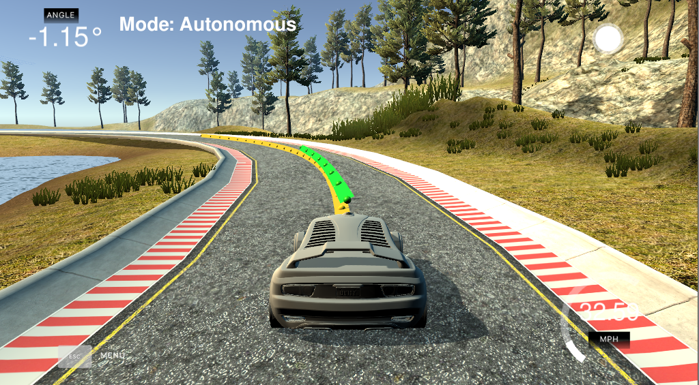

# MPC Controls


 
## Overview
This project represents an object-oriented implementation of  c++ implementation of a Model Predictive Control (MPC) to control the steering angle and the throttle acceleration of a car driving around a simulated track. A [simulator provided by Udacity](https://github.com/udacity/self-driving-car-sim/releases) provides the cars' position(x,y), orientation (psi) and the velocity (v in mph). The MPC generates steering and accelerating commands to control the car around the track. The  [uWebSocketIO](https://github.com/uWebSockets/uWebSockets)  package facilitates the connection between the simulator and code by setting up a web socket server connection from the C++ program to the simulator, which acts as the host. 


## Prerequisites & Dependencies

This project involves the CarND Simulator ( Term 2) which can be downloaded [here.](https://github.com/udacity/self-driving-car-sim/releases) This repository includes two files that can be used to set up and install [uWebSocketIO](https://github.com/uWebSockets/uWebSockets) for either Linux or Mac systems.  To install the uWebSocketIO libraries, use `install-linux.sh ` on Linux or `./install-mac.sh ` on Mac system.

The project Also has the following dependencies:

  * cmake >= 3.5
&nbsp;&nbsp;&nbsp;&nbsp;All OSes: [click here for installation instructions](https://cmake.org/install/)<br/>

  * make >= 4.1 (Linux, Mac)
  &nbsp;&nbsp;&nbsp;&nbsp; Linux: make is installed by default on most Linux distros
  &nbsp;&nbsp;&nbsp;&nbsp;Mac: [install Xcode command line tools to get make](https://developer.apple.com/xcode/features/)<br/>
  
  * gcc/g++ >= 5.4
   &nbsp;&nbsp;&nbsp;&nbsp;Linux: gcc / g++ is installed by default on most Linux distros
  &nbsp;&nbsp;&nbsp;&nbsp;Mac: same deal as make - [install Xcode command line tools](https://developer.apple.com/xcode/features/)
  
  * **Ipopt and CppAD:** Please refer to [this document](https://github.com/udacity/CarND-MPC-Project/blob/master/install_Ipopt_CppAD.md) for installation instructions.
* [Eigen](http://eigen.tuxfamily.org/index.php?title=Main_Page). This is already part of the repo.


## Basic Build Instructions

Clone this repo, and cd to it on a Terminal. Install *uWebSocketIO* as described above. Once the installation of uWebSocketIO is complete, the main program can be built and run by doing the following from the project top directory.
```sh
# To build
mkdir build && cd build
cmake ..
make

# To run
./mpc
```
## MPC Control
 
- **Model**  
Here, a Kinematic model is used to approximate the vehicle dynamics.  This model uses the state and actuations from the previous timestep to calculate the current state. States are represented by [x,y,psi,v,cte,epsi]. The model equations are as follow: 

```
// x,y: Position of the car 
// delta: steering angle
x[t+1] = x[t] + v[t] * cos(psi[t]) * dt
y[t+1] = y[t] + v[t] * sin(psi[t]) * dt

// psi: Orientation or heading
// Lf:  Constant describing the distance between the 
//       center of mass of the vehicle and it's front axle
psi[t+1] = psi[t] + v[t] / Lf * delta[t] * dt

// V: Speed 
v[t+1] = v[t] + a[t] * dt

// cte: Error between the center of the road and the vehicle’s position 
//        Cross track error
cte[t+1] = f(x[t]) - y[t] + v[t] * sin(epsi[t]) * dt

// epsi: Orientation Error
// psides: ground Orientation truth
epsi[t+1] = psi[t] - psides[t] + v[t] * delta[t] / Lf * dt
```

- **Timestep Length and Elapsed Duration (N & dt)**    
MPC attempts to approximate a continuous reference trajectory by means of discrete paths between actuations. Larger values of dt result in less frequent actuations. On the otherhand, smaller dt values will result in an unstable driving behavior.  I started with N = 15 and dt as 0.1. The reference speed was also set to 100. In this setting the car successfully finished the first half of the track, but left the road on the second half, where the track had more curves. Then, I tried other numbers aiming to contorl the car as fast, and accurate as possible. The final numbers are: N = 10, and dt = 0.1, and reference speed= 50.


- **Polynomial Fitting and MPC Preprocessing** 
The simulator returns the position of the car (x,y), its orientation (psi) and the waypoints (ptsx[i], ptsy[i]) in a global cordinate system. Before fitting the waypoints, they were translated into the coordinate system of the car:

```c++
vector<double> wps_x;
vector<double> wps_y;

for (int i = 0; i < ptsx.size(); i++) {
	double dx = ptsx[i] - px;
	double dy = ptsy[i] - py;
	wps_x.push_back(dx * cos(-psi) - dy * sin(-psi));
	wps_y.push_back(dx * sin(-psi) + dy * cos(-psi));
}
```
After this transformation, the polyfit function from the helper file was used to generate the coefficients for a 3rd order polynomial function.

```
double *ptrx = &wps_x[0];
double *ptry = &wps_y[0];

Eigen::Map<Eigen::VectorXd> ptsx_eig(ptrx, 6);
Eigen::Map<Eigen::VectorXd> ptsy_eig(ptry, 6);

auto coeffs = polyfit(ptsx_eig, ptsy_eig, 3);
```
- **Latency** 

Since the timestep elapsed duration is 0.1 second (or 100ms),  the delay of 100ms is countered by considering the actuator outputs [delta, a] from the previous time step [t-1] as the delay here is equal to the time step length dt (0.1 s or 100 ms) of the model.

```
AD<double> delta0 = vars[delta_start + t - 1];
AD<double> a0 = vars[a_start + t - 1];

// Latency Fix
if (t > 1){
	delta0 = vars[delta_start + t - 2];
	a0 = vars[a_start + t - 2];
}
```


